# Indy Open APRS - Documentación Ver. 1.5.37

**Firmware APRS abierto para ESP8266 basado en la plataforma de hardware TA1KNN**

Indy Open APRS es un firmware desarrollado para una plataforma APRS formada por **ESP8266 / NodeMCU + Nano TNC basada en ATmega**. El proyecto proporciona una interfaz web para configuración, diagnóstico, mensajería APRS, telemetría, actualización OTA, respaldo y operación como iGate.

- **Proyecto:** Indy Open APRS
- **Firmware actual:** XE3JAC
- **Firmware TNC actual:** XE3JAC
- **Firmware TNC original:** SQ9MDD
- **Hardware de referencia:** TA1KNN    

# WEBFLASHER - Indy Open iGate o Indy Open Tracker
**https://xe3jac.github.io/IndyOpen-APRS-Project/webflasher**

# WEBFLASHER - TNC
**https://xe3jac.github.io/IndyOpen-APRS-Project/tnc-webflasher**

---

## Contenido

- [1. Descripción general](#1-descripción-general)
- [2. Arquitectura del sistema](#2-arquitectura-del-sistema)
- [3. Accesos y seguridad](#3-accesos-y-seguridad)
- [4. Configuración general](#4-configuración-general)
- [5. Mensajes APRS](#5-mensajes-aprs)
- [6. Estado y contactos](#6-estado-y-contactos)
- [7. Actualización OTA](#7-actualización-ota)
- [8. Respaldo y restauración](#8-respaldo-y-restauración)
- [9. Registro](#9-registro)
- [10. Pantalla OLED](#10-pantalla-oled)
- [11. Instalación inicial por USB](#11-instalación-inicial-por-usb)
- [12. Nano TNC basada en ATmega](#12-nano-tnc-basada-en-atmega)
- [13. Instalación mediante Web Flasher](#13-instalación-mediante-web-flasher)
- [14. Historia y créditos](#14-historia-y-créditos)
- [15. Recomendaciones](#15-recomendaciones)

---

## 1. Descripción general

Indy Open APRS dispone de una interfaz web desde la que se pueden configurar y supervisar las principales funciones del sistema.

Las secciones disponibles son:

- **Accesos**
- **Configuración**
- **Mensajes**
- **Estado**
- **Contactos**
- **Actualizar**
- **Respaldo**
- **Registro**
- **Ayuda**

Los valores mostrados en las capturas —indicativos, direcciones IP, coordenadas, rutas, servidores y lecturas— son ejemplos de una estación configurada.

### Primera puesta en marcha recomendada

1. Configurar las credenciales del punto de acceso y del acceso OTA.
2. Seleccionar el modo de operación.
3. Configurar Wi-Fi.
4. Configurar APRS-IS cuando el modo seleccionado lo requiera.
5. Configurar indicativo, posición, símbolo, comentario, intervalo de baliza y ruta RF.
6. Revisar TNC, NTP, offset UTC y telemetría.
7. Guardar la configuración.
8. Comprobar el funcionamiento en **Estado** y **Registro**.
9. Descargar un respaldo cuando la instalación sea estable.

---

## 2. Arquitectura del sistema

La arquitectura de referencia separa el procesamiento principal y las funciones de radio:

**Radio ⇄ Nano TNC / ATmega ⇄ ESP8266 / NodeMCU ⇄ Wi-Fi / APRS-IS**

El ESP8266 ejecuta Indy Open APRS y se encarga de la interfaz web, red, APRS-IS, OLED, telemetría, registro y configuración.

La Nano TNC utiliza su propio firmware y realiza las funciones TNC/KISS necesarias para la comunicación APRS por RF.

---

## 3. Accesos y seguridad

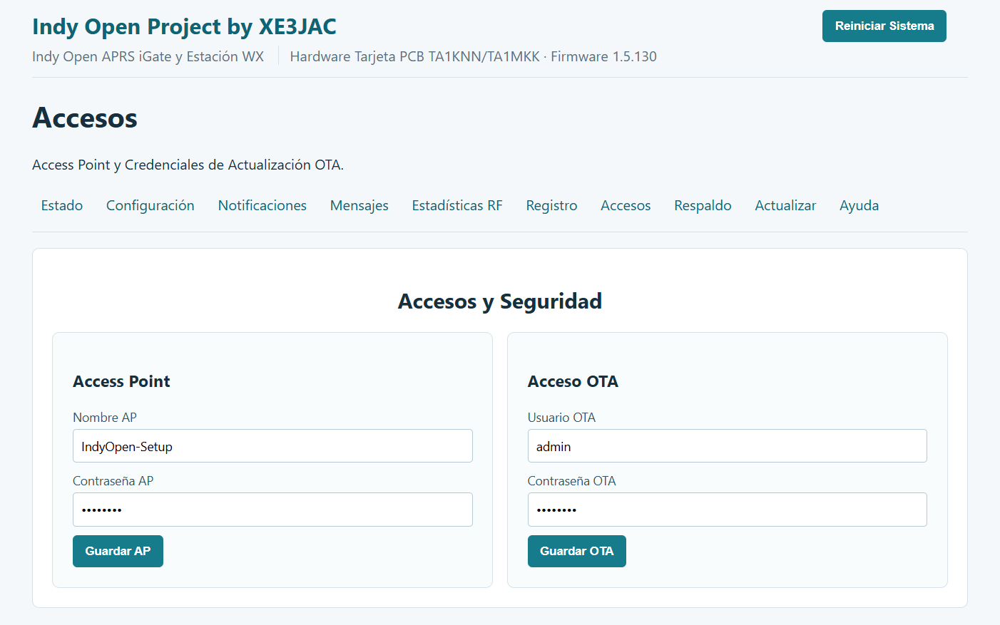

La pantalla **Accesos** permite configurar:

- **Nombre AP:** nombre de la red inalámbrica creada por el equipo.
- **Contraseña AP:** contraseña del punto de acceso.
- **Usuario OTA:** usuario para operaciones protegidas.
- **Contraseña OTA:** contraseña asociada al acceso OTA.

### Credenciales predeterminadas

En una instalación nueva, las credenciales predefinidas son:

| Acceso | Usuario / SSID | Contraseña |
|---|---|---|
| **Acceso OTA** | `admin` | `indygate` |
| **Wi-Fi / Access Point** | `admin` | `indygate` |

> **Importante:** estas son las credenciales iniciales. Por seguridad, se recomienda cambiarlas desde la sección **Accesos** después de la primera configuración.

> **Precaución:** conserve las credenciales OTA en un lugar seguro.

---

## 4. Configuración general

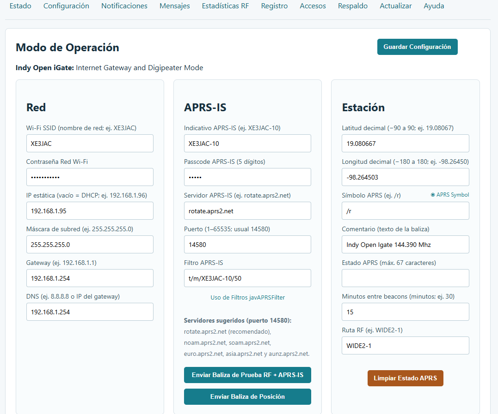

### Modo de operación

El selector determina la función principal del equipo. La interfaz incluye modos como:

- **iGate ON (APRS-IS)**
- **Digipeater**
- **Tracker**

### Red

- Wi-Fi SSID
- Wi-Fi password
- IP estática o DHCP
- Máscara
- Gateway
- DNS

### APRS-IS

- Indicativo APRS-IS
- Passcode
- Servidor
- Puerto
- Filtro APRS-IS

### Estación

- Latitud APRS
- Longitud APRS
- Símbolo
- Comentario
- Estado APRS
- Minutos entre beacons
- Ruta RF
- Baliza de prueba
- Posición de prueba

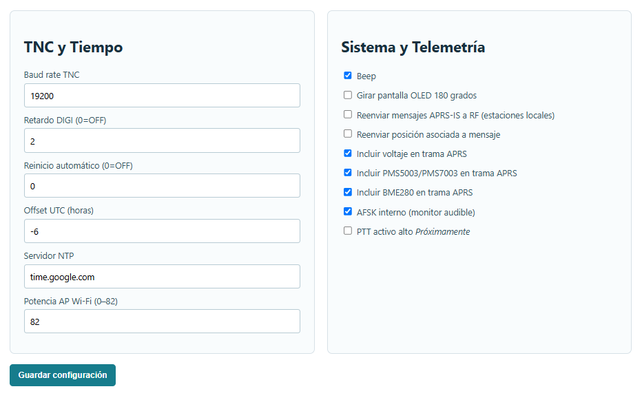

### TNC y tiempo

- Baud rate TNC
- Retardo DIGI
- Reinicio automático
- Offset UTC
- Servidor NTP
- Potencia del AP Wi-Fi

### Sistema y telemetría

La interfaz permite habilitar o deshabilitar funciones como beep, orientación OLED, reenvío APRS-IS → RF, telemetría, monitor AFSK y opciones relacionadas con PTT.

---

## 5. Mensajes APRS

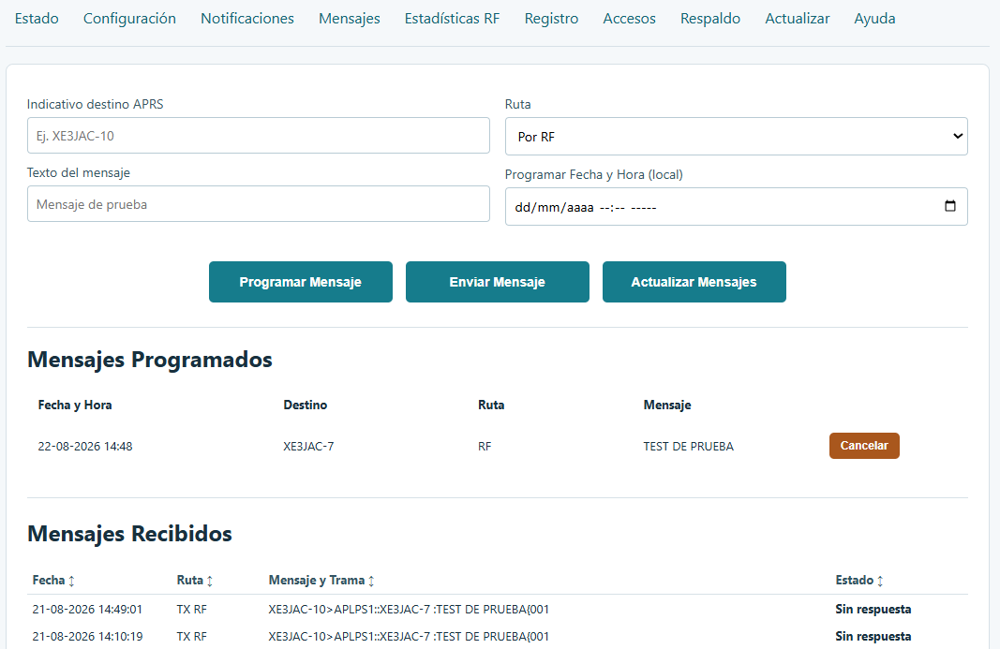

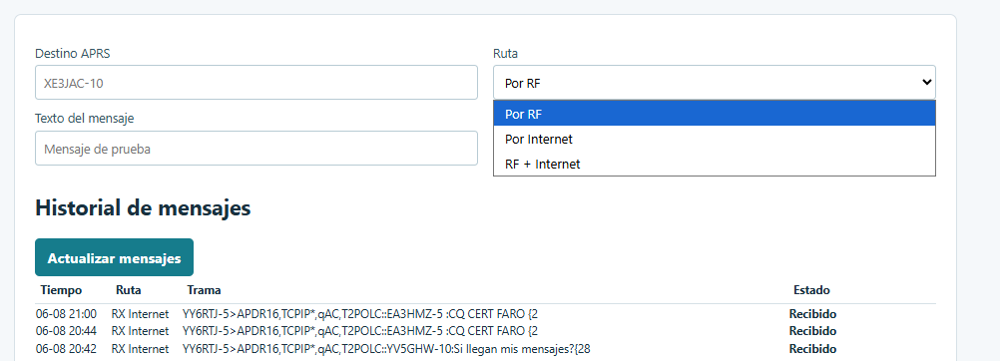

Para enviar un mensaje:

1. Introduzca el indicativo en **Destino APRS**.
2. Escriba el texto.
3. Seleccione la ruta:
   - Por RF
   - Por Internet
   - RF + Internet
4. Pulse **Enviar mensaje**.
5. Consulte el historial para verificar el estado.

El historial puede mostrar estados como **Pendiente**, **Confirmado**, **Reenviado** o **Sin respuesta**.

---

## 6. Estado y contactos

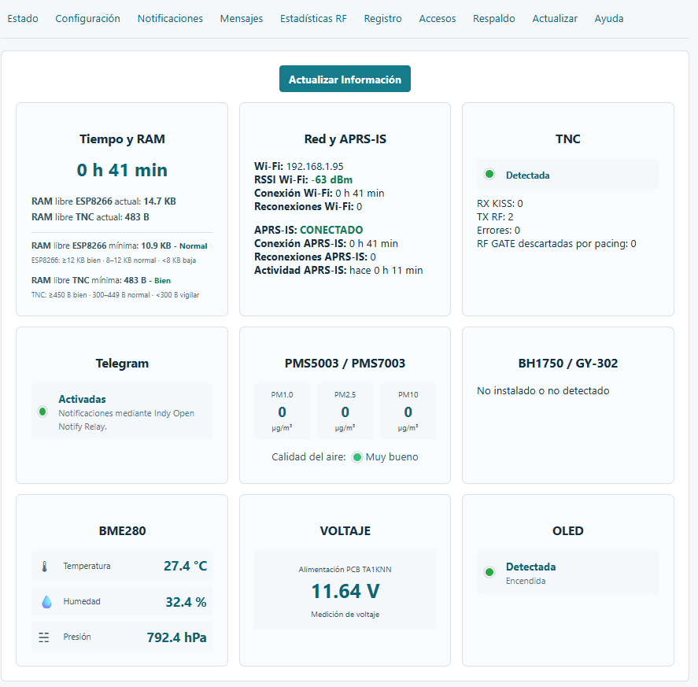

La pantalla **Estado** permite revisar:

- Tiempo encendido
- Wi-Fi
- Estado APRS-IS
- TNC/KISS
- RX RF
- TX RF
- PMS5003/PMS7003
- BME280
- Voltaje
- OLED

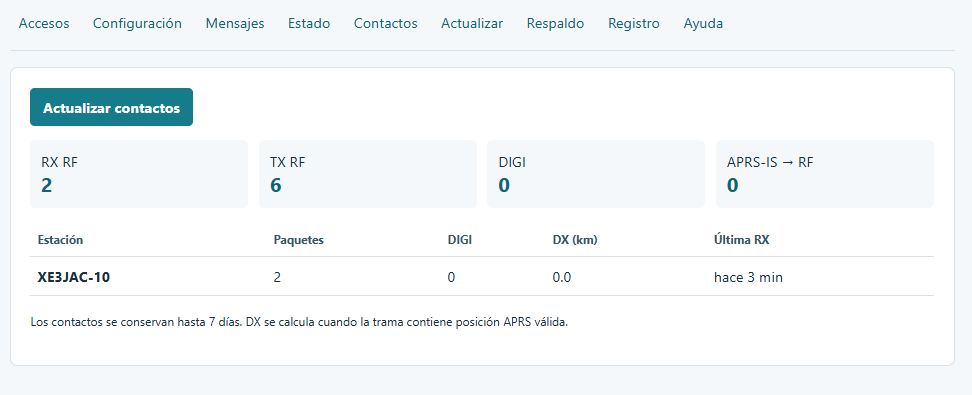

La sección **Contactos** muestra actividad reciente por RF e información de estaciones recibidas.

---

## 7. Actualización OTA

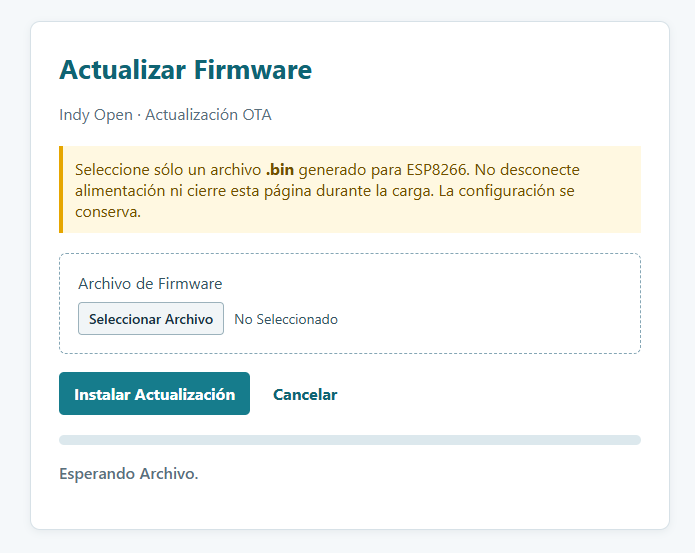

La actualización OTA permite instalar una nueva versión del firmware del ESP8266 desde la interfaz web.

1. Seleccione el archivo `.bin`.
2. Verifique que corresponde al ESP8266.
3. Pulse **Instalar actualización**.
4. No desconecte la alimentación ni cierre la página.
5. Espere hasta que el proceso termine.

> Utilice únicamente firmware creado para el hardware correspondiente.

---

## 8. Respaldo y restauración

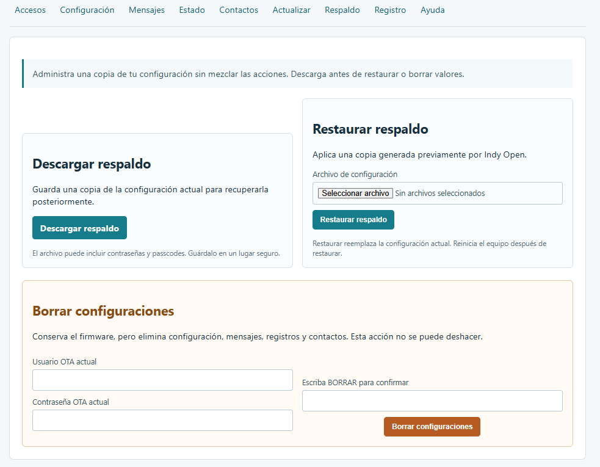

### Descargar respaldo

Genera una copia de la configuración actual.

### Restaurar respaldo

Permite seleccionar un respaldo previamente generado y sustituir la configuración actual.

### Borrar configuraciones

Elimina configuración, mensajes, registros y contactos, pero conserva el firmware.

> **Precaución:** descargue un respaldo antes de borrar la configuración.

---

## 9. Registro

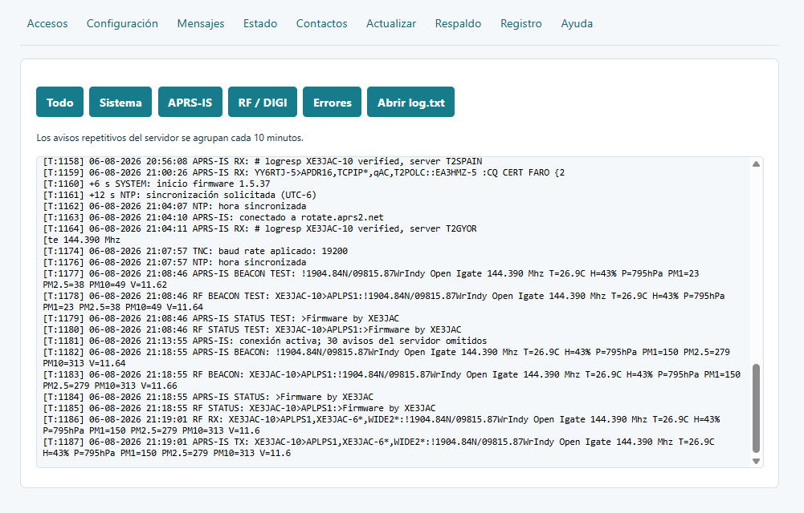

El registro facilita el diagnóstico. Los filtros disponibles incluyen:

- Todo
- Sistema
- APRS-IS
- RF / DIGI
- Errores

También se puede consultar `log.txt`.

---

## 10. Pantalla OLED

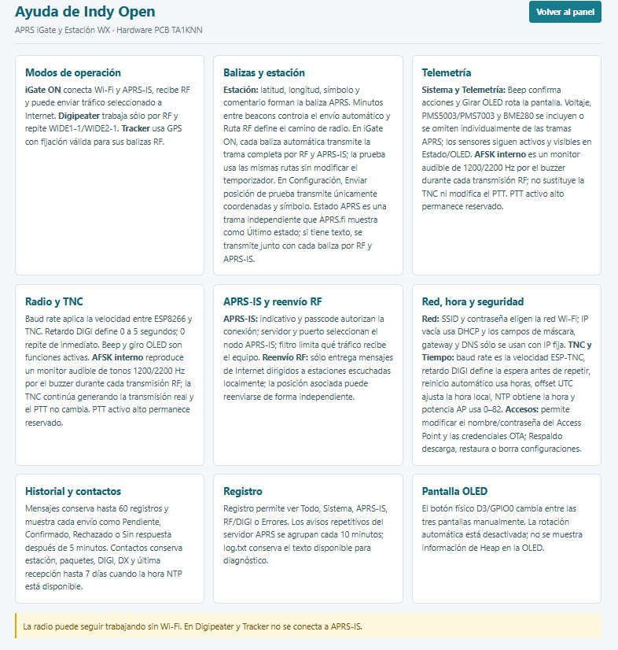

El equipo utiliza una OLED de **0.96 pulgadas, 128×64 píxeles**.

Las tres pantallas de operación son **fijas**. Para cambiar de una pantalla a la siguiente se debe pulsar el **switch o botón físico del sistema**. Después de la tercera pantalla se vuelve a la primera.

Las vistas muestran información como:

1. Resumen del sistema, indicativo, IP y APRS-IS.
2. Estado TNC/KISS y actividad RF.
3. Sensores PMS/BME e información I2C/OLED.

La pantalla OLED también puede mostrar un bitmap monocromático de **128×64 píxeles** durante el arranque.

---

## 11. Instalación inicial por USB

El firmware del ESP8266 y el firmware de la Nano TNC son independientes.

### ESP8266 / NodeMCU

1. Conecte el ESP8266 a la computadora con un cable USB de datos.
2. Identifique el puerto COM.
3. Seleccione el firmware correspondiente.
4. Inicie la programación.
5. Espere hasta que termine correctamente.
6. Reinicie el ESP8266.
7. Acceda al AP de Indy Open APRS y realice la configuración inicial. Las credenciales predeterminadas son `admin` / `indygate`.

> No desconecte el USB mientras se está escribiendo el firmware.

Para la primera conexión recuerde las credenciales predefinidas: **usuario/SSID `admin` y contraseña `indygate`**.

---

## 12. Nano TNC basada en ATmega

La Nano TNC realiza la interfaz APRS por RF y utiliza firmware independiente.

Procedimiento general:

1. Conecte la Nano por USB.
2. Identifique el puerto serie.
3. Verifique el microcontrolador/bootloader correspondiente.
4. Seleccione el firmware TNC.
5. Programe la Nano.
6. Espere la confirmación.
7. Vuelva a instalarla en el sistema.
8. Compruebe que Indy Open APRS muestra el TNC activo.

La publicación histórica de la plataforma acredita el firmware TNC a **SQ9MDD**.

---

## 13. Instalación mediante Web Flasher

El Web Flasher permite realizar la instalación inicial del firmware del ESP8266 directamente desde un navegador compatible.

### Requisitos

- Computadora
- Navegador compatible con puerto serie
- Cable USB de datos
- ESP8266 / NodeMCU
- Web Flasher oficial de Indy Open APRS

### Procedimiento

1. Conecte el ESP8266 por USB.
2. Abra el Web Flasher.
3. Pulse el botón de conexión/instalación.
4. Seleccione el puerto serie.
5. Autorice la conexión.
6. Seleccione la versión correcta del firmware.
7. Inicie la instalación.
8. Espere hasta el 100 %.
9. Reinicie el equipo.
10. Realice la configuración inicial.

### Web Flasher vs OTA

| Método | Conexión | Uso |
|---|---|---|
| Web Flasher | USB | Primera instalación o recuperación |
| OTA | Red | Actualización de un equipo ya operativo |
| Programación USB tradicional | USB | Instalación o recuperación manual |

> La Nano TNC es independiente y no se debe asumir que puede programarse desde el mismo Web Flasher del ESP8266.

---

## 14. Historia y créditos

Indy Open APRS utiliza como plataforma de referencia la arquitectura de hardware de la **PCB TA1KNN**.

La publicación histórica del proyecto APRS iGATE acredita:

| Elemento | Autor / referencia |
|---|---|
| Firmware actual | **XE3JAC** |
| Firmware actual TNC | **XE3JAC** |
| PCB / hardware | **TA1KNN** |
| Firmware original TNC | **SQ9MDD** |

Indy Open APRS es un firmware posterior y propio para ESP8266. 
La referencia a **PCB TA1KNN** describe la plataforma física utilizada como base y no implica autoría del firmware Indy Open APRS.

---

## 15. Recomendaciones

- Configure primero accesos y red.
- Cambie las credenciales predeterminadas `admin` / `indygate` después de la primera configuración.
- Verifique el modo de operación antes de transmitir.
- Revise posición, símbolo, comentario y ruta RF.
- Utilice **Estado** y **Registro** para diagnóstico.
- Haga un respaldo después de alcanzar una configuración estable.
- Mantenga alimentación estable durante OTA o Web Flasher.
- No mezcle el firmware del ESP8266 con el firmware de la Nano TNC.

---

## Créditos

**Indy Open APRS**  
Indy Open Project by **XE3JAC**

Documentación basada en la interfaz y hardware de referencia del proyecto.

## ☕ Apoya el proyecto

Indy Open es un proyecto comunitario desarrollado por interés en la radioafición, la experimentación y el hardware/software abierto.

Si quieres ayudar a continuar desarrollando placas, probando hardware y creando nuevas funciones, podrás apoyar voluntariamente el proyecto.

❤️ **Las donaciones son completamente opcionales.**

**¡Gracias por apoyar Indy Open APRS! 73 de XE3JAC**
